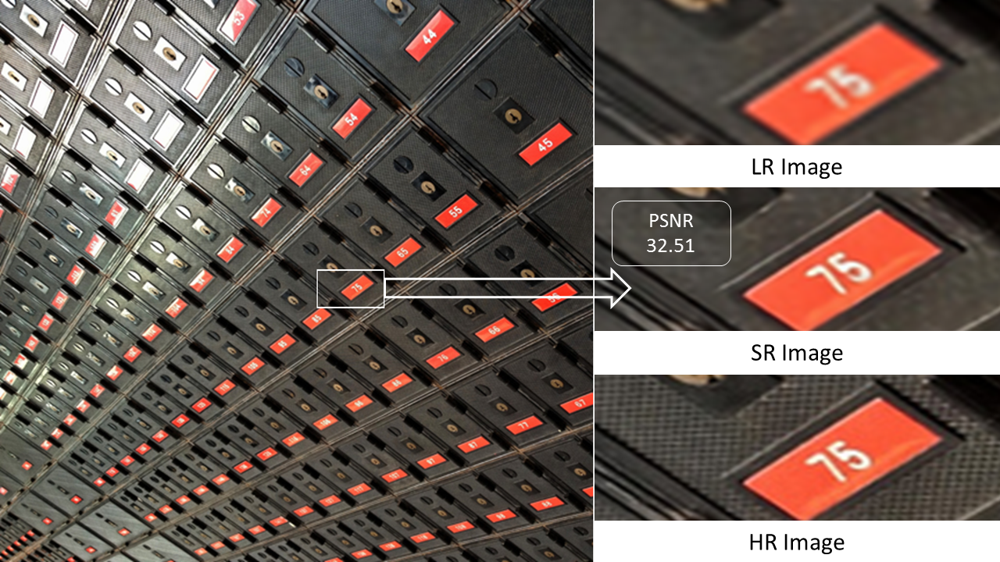
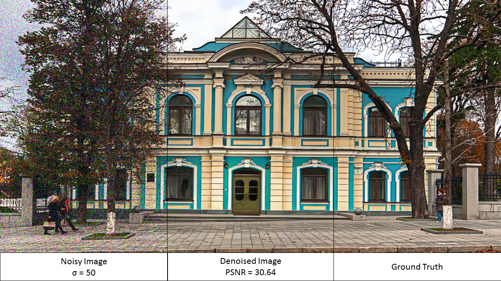

# Pixelfix

Pixelfix is a web service that enhances the image quality by providing automatic image super resolution and image denoising based on two accurate and lightweight deep learning models.

## Features 

* Pixelfix can upscale the low quality image with factor of 2, 3 or 4 to higher resolution image by using MCARN model.
* Pixelfix can reduce the image Gaussian noise with smoothing factor from 1 to 75 by using FFDENT model.
* Pixelfix can estimate value of smoothing factor automatically in order to preserve image details.

## Datasets

* For Single Image super resolution DIV2K Dataset was used as a training dataset.
* For Image denoising Waterloo Exploration database was used and corrupted with random noise levels.

## Evaluation Metrics

* PSNR computes the peak signal-to-noise ratio, in decibels, between two images.
* SSIM (structural similarity) is used for measuring the similarity between two images.

## Application Demo

## Authors

* [Marwan Morsy](https://github.com/Marwan-Morsy)
* [Karim Gerges]
* [Ahmed Reda](https://github.com/AhmedRedaAmin)
* [Mohammed Bakr](https://github.com/MohamedBakrAli)
* [Mostafa Shabana]
* [Wesam Yakout]

## Sample Results

* Super Resolution Results
 

* Image Denoising Results
 

